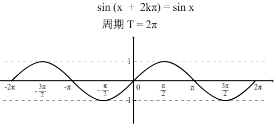
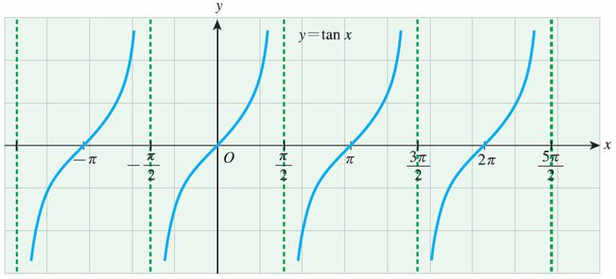
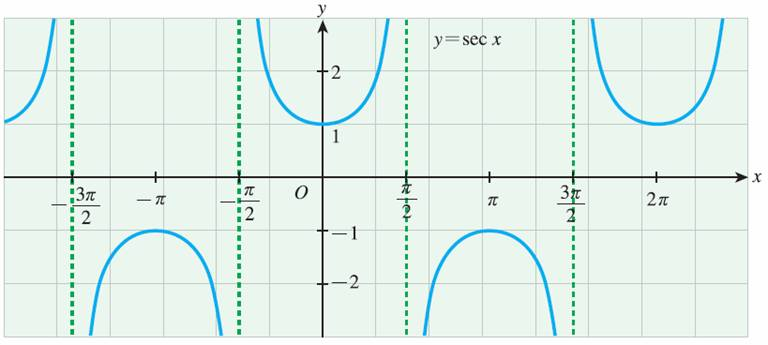
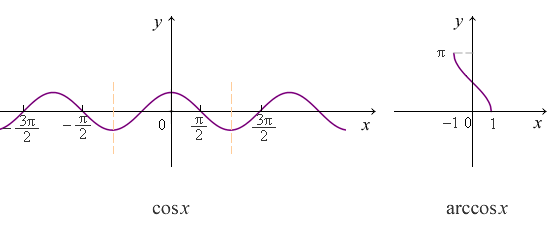

# 三角函数

| 三角函数 |       描述       | 函数名 | 表达式 |
| :------: | :--------------: | :----: | :----: |
|   sin    |  ∠A的对边比斜边  |  正弦  |  a/c   |
|   cos    |  ∠A的邻边比斜边  |  余弦  |  b/c   |
|   tan    |  ∠A的对边比邻边  |  正切  |  a/b   |
|   cot    | *∠A*的邻边比对边 |  余切  |  b/a   |
|   sec    | *∠A*的斜边比邻边 |  正割  |  c/b   |
|   csc    |  ∠A的斜边比对边  |  余割  |  c/a   |

**sin** 与 **csc** 互为倒数

**cos** 与 **sec** 互为倒数

**tan** 与 **cot** 互为倒数

**tan = sin / cos**

**cot = cos / sin**

**cos x = sin (x + π/2)**

## sin 图像

| [奇偶性](https://zh.wikipedia.org/wiki/奇函數與偶函數) | 奇     |
| ------------------------------------------------------ | ------ |
| [定义域](https://zh.wikipedia.org/wiki/定义域)         | (-∞,∞) |
| [到达域](https://zh.wikipedia.org/wiki/到达域)         | [-1,1] |
| [周期](https://zh.wikipedia.org/wiki/周期函数)         | 2π     |

## cos 图像

| [奇偶性](https://zh.wikipedia.org/wiki/奇函數與偶函數) | 偶     |
| ------------------------------------------------------ | ------ |
| [定义域](https://zh.wikipedia.org/wiki/定义域)         | (-∞,∞) |
| [值域](https://zh.wikipedia.org/wiki/到达域)           | [-1,1] |
| [周期](https://zh.wikipedia.org/wiki/周期函数)         | 2π     |

## tan 图像

| 奇偶性 | 奇                 |
| ------ | ------------------ |
| 定义域 | {x\|x≠kπ+π/2，k∈Z} |
| 值域   | (-∞,∞)             |
| 周期   | π                  |

## cot 图像

| [奇偶性](https://zh.wikipedia.org/wiki/奇函數與偶函數) | 奇               |
| ------------------------------------------------------ | ---------------- |
| [定义域](https://zh.wikipedia.org/wiki/定义域)         | {x∈R〡x≠kπ，k∈Z} |
| [到达域](https://zh.wikipedia.org/wiki/到达域)         | (-∞,+∞)          |
| [周期](https://zh.wikipedia.org/wiki/周期函数)         | π                |

## sec 图像

| [奇偶性](https://zh.wikipedia.org/wiki/奇函數與偶函數) | 偶                 |
| ------------------------------------------------------ | ------------------ |
| [定义域](https://zh.wikipedia.org/wiki/定义域)         | {x\|x≠kπ+π/2，k∈Z} |
| [到达域](https://zh.wikipedia.org/wiki/到达域)         | \|secx\|≥1         |
| [周期](https://zh.wikipedia.org/wiki/周期函数)         | 2π                 |

## csc 图像

| [奇偶性](https://zh.wikipedia.org/wiki/奇函數與偶函數) | 奇             |
| ------------------------------------------------------ | -------------- |
| [定义域](https://zh.wikipedia.org/wiki/定义域)         | {x\|x≠kπ，k∈Z} |
| [到达域](https://zh.wikipedia.org/wiki/到达域)         | \|csc x\|≥1    |
| [周期](https://zh.wikipedia.org/wiki/周期函数)         | 2π             |

## 反三角函数

即三角函数的反函数，在对应三角函数的前面加个 **arc** 即是对应的反三角函数。高数中用到的有四个：

| 反三角函数 | 中文名 | 描述         |
| ---------- | ------ | ------------ |
| arcsin     | 反正弦 | sin 的反函数 |
| arccos     | 反余弦 | cos 的反函数 |
| arctan     | 反正切 | tan 的反函数 |
| arccot     | 反余切 | cot 的反函数 |

### arcsin 图像

| [奇偶性](https://zh.wikipedia.org/wiki/奇函數與偶函數) | 奇          |
| ------------------------------------------------------ | ----------- |
| [定义域](https://zh.wikipedia.org/wiki/定义域)         | [-1, 1]     |
| [到达域](https://zh.wikipedia.org/wiki/到达域)         | [–π/2，π/2] |
| [周期](https://zh.wikipedia.org/wiki/周期函数)         | N/A         |

### arccos 图像

| [奇偶性](https://zh.wikipedia.org/wiki/奇函數與偶函數) | 非奇非偶函数 |
| ------------------------------------------------------ | ------------ |
| [定义域](https://zh.wikipedia.org/wiki/定义域)         | [-1, 1]      |
| [到达域](https://zh.wikipedia.org/wiki/到达域)         | [0，π]       |
| [周期](https://zh.wikipedia.org/wiki/周期函数)         | N/A          |

### arctan 和 arccot 图像

## 三角函数重点值

|         |  0   |             π/4              | π/2  |  π   |
| :-----: | :--: | :--------------------------: | :--: | :--: |
| **sin** |  0   | [2^(1/2)]/2 or (1/[2^(1/2)]) |  1   |  0   |
| **cos** |  1   | [2^(1/2)]/2 or (1/[2^(1/2)]) |  0   |  -1  |
| **tan** |  0   |              1               |  ∞   |  0   |
|   cot   |  ∞   |              1               |  0   |  ∞   |
|   sec   |  1   |           2^(1/2)            |  ∞   |  -1  |
|   csc   |  ∞   |           2^(1/2)            |  1   |  ∞   |

*其实只需记住 sin，cos，tan 这三个就行，因为 

cot = tan^1/2；sec = cos^1/2；csc = sin^1/2

## 常用三角函数公式

### 互逆恒等式

### 毕达哥拉斯恒等式

**(sinα)^2 +(cosα)^2 = 1       1 + (tanα)^2 = (secα)^2       1 + (cotα)^2 = (cscα)^2**

### 其他恒等式

tanα * cotα = 1
cosα * secα = 1
sinα * cscα = 1

tanα = sinα / cosα
cotα = cosα / sinα

### 诱导公式

sin（2kπ+α）=sinα；cos(2kπ+α）=cosα；

tan（kπ+α）=tanα；

cot（kπ+α）=cotα；sec（2kπ+α）=secα；

csc（2kπ+α）=cscα；

sin（π+α）=－sinα；cos（π+α）=－cosα；

tan（π+α）=tanα；

cot（π+α）=cotα；sec(π+α)=－secα；

csc（π+α）=－cscα；

sin（－α）=－sinα；cos（－α）=cosα；

tan（－α）=－tanα；

cot（－α）=－cotα；sec（－α）=secα；

csc（－α）=－cscα；

sin（π－α）=sinα；cos（π－α）=-cosα；

tan（π－α）=－tanα；

cot（π－α）=－cotα；sec（π－α）=-secα；

csc（π-α）=cscα；

sin（α-π）=－sinα；cos（α-π）=－cosα；

tan（α-π）=tanα；

cot（α-π）=cotα；sec(α-π)=－secα；

csc（α-π）=－cscα；

sin（2π－α）=－sinα；cos（2π－α）=cosα；

tan（2π－α）=－tanα；

cot（2π－α）=－cotα；sec（2π－α）=secα；

csc（2π－α）=－cscα；

sin（π/2+α）=cosα；cos（π/2+α）=－sinα；

tan（π/2+α）=－cotα；

cot（π/2+α）=－tanα；sec(π/2+α)=－cscα；

csc（π/2+α）=secα；

sin（π/2－α）=cosα；cos（π/2－α）=sinα；

tan（π/2－α）=cotα；

cot（π/2－α）=tanα；sec（π/2－α）=cscα；

csc（π/2－α）=secα；

sin（3π/2+α）=－cosα；cos（3π/2+α）=sinα；

tan（3π/2+α）=－cotα；

cot（3π/2+α）=－tanα；sec（3π/2+α）=cscα；

csc（3π/2+α）=－secα；

sin（3π/2－α）=－cosα；cos（3π/2－α）=－sinα；

tan（3π/2－α）=cotα；

cot（3π/2－α）=tanα；sec（3π/2－α）=－cscα；

csc（3π/2－α）=－secα；

补：

sin(nπ + α) = (-1)^n * sinα
cos(nπ + α) = (-1)^n * cosα

### 半角公式

**半角正弦公式**

或：

**半角余弦公式**

或：

**半角正切公式**

**半角余切公式**

**半角正割公式**

**半角余割公式**

**其他**

### (二)倍角公式

### (三)倍角公式

### 两角和差

cos(α+β)=cosα·cosβ-sinα·sinβ

cos(α-β)=cosα·cosβ+sinα·sinβ

sin(α±β)=sinα·cosβ±cosα·sinβ

tan(α+β)=(tanα+tanβ)/(1-tanα·tanβ)

tan(α-β)=(tanα-tanβ)/(1+tanα·tanβ)

### 和差化积

sinα+sinβ=2sin[(α+β)/2]cos[(α-β)/2]

sinα-sinβ=2cos[(α+β)/2]sin[(α-β)/2]

cosα+cosβ=2cos[(α+β)/2]cos[(α-β)/2]

cosα-cosβ=-2sin[(α+β)/2]sin[(α-β)/2]

### 积化和差

sinα·cosβ=(1/2)[sin(α+β)+sin(α-β)]

cosα·sinβ=(1/2)[sin(α+β)-sin(α-β)]

cosα·cosβ=(1/2)[cos(α+β)+cos(α-β)]

sinα·sinβ=-(1/2)[cos(α+β)-cos(α-β)]

### 反三角函数相关

**负数关系**

**余角关系**

**倒数关系**

arctan(α) = arccot(1/α) (x > 0)

**加减法公式**

### 未完待续

